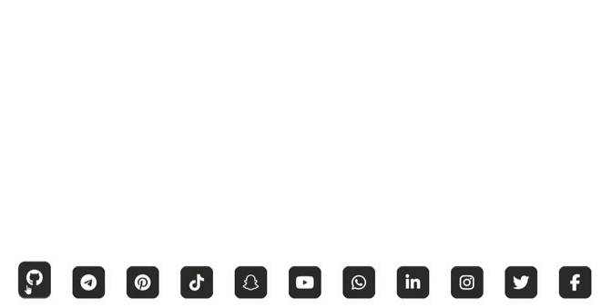

# Social Media Buttons - أزرار وروابط الشبكات الاجتماعية 🔗

صفحة ويب تعرض أزرار روابط لأشهر منصات التواصل الاجتماعي مع تصميم بسيط وأنيق.

---

## 🔗 العرض المباشر

🎯 يمكنك مشاهدة المشروع مباشرًة من خلال الرابط التالي:

👈 [شاهد الصفحة من هنا](https://alostoura-official.github.io/Social-Media-Buttons/)

---

## 📸 معاينة

لقطة توضح تصميم الأزرار:

  

---

## 🎯 فكرة المشروع

يهدف المشروع إلى توفير طريقة سهلة وأنيقة لعرض روابط الشبكات الاجتماعية باستخدام أيقونات FontAwesome.  
يمكنك تعديل الروابط وإضافة منصات جديدة بسهولة.

---

## 🛠️ الميزات

- أزرار متجاوبة وجميلة مع تأثيرات حركة.
- دعم لأشهر الشبكات الاجتماعية مثل فيسبوك، تويتر، انستقرام، لينكدإن، واتساب، ويوتيوب.
- فتح الروابط في تبويبات جديدة.
- تصميم بسيط وسهل التخصيص.

---

## 📝 ⚖️الرخصة

تم نشر هذا المشروع بموجب رخصة **[MPL-2.0](LICENSE)**.

---

## 🙌 المساهمة

نرحب بمساهماتكم!  
لا تتردد في فتح **issue** أو إرسال **pull request** لتحسين وتطوير المشروع.

---

شكراً لدعمكم ! 🚀
